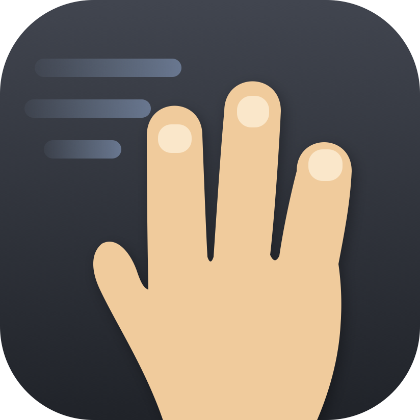
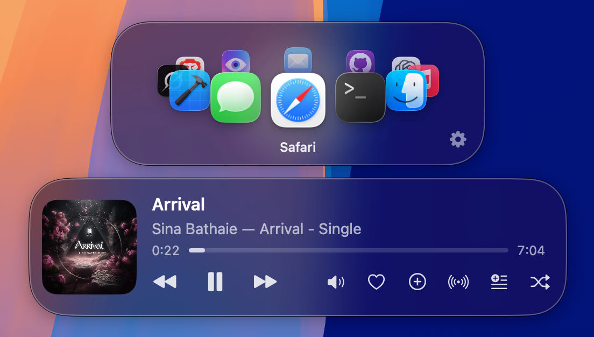

<p align="center">
  
</p>

# AppGlide

Switch between macOS apps with a 3-finger trackpad swipe, iPad-style. A lightweight menu-bar utility: the windows of the app you glide to come straight to the front — no Cmd-Tab, no Spaces, no full-screen required.

It's made for Mac users who live on a single desktop with overlapping windows — who don't use multiple desktops and never click the green button to full-screen their apps. macOS reserves the 3-finger swipe for exactly those two features and offers nothing for everyone else; AppGlide gives that gesture to the rest of us, switching between the apps themselves.



## Gestures

| Gesture | What it does |
|---|---|
| **Flick** — quick 3-finger swipe left/right | Switches to the next/previous app immediately. Swipe right goes to the previous (older) app; swipe left goes forward. |
| **Glide (scrub)** — swipe and keep fingers down | Steps through one app per detent of travel, with a haptic tick each step. Reverse direction mid-glide to step back. The selected app activates once the selection holds still for the focus delay (default 0.5s, tunable in Settings → Switching). |
| **Wrap** | The ring is circular — keep going in one direction and you'll come back around. |
| **3-finger click** (while the switcher is up) | Quits the app currently selected in the carousel. |
| **Hover the HUD** | Pins it open (it normally fades after the visible duration, 1.5s by default). |
| **Click a HUD icon** | Jumps straight to that app and pulls it in next to the current one on the ring, instead of rotating everything. |
| **Right-click a HUD icon** | Quits that app. |
| **3-finger swipe down** | Toggles the Apple Music HUD: album art, track info, progress scrubber, volume, previous/play-pause/next, favorite ♥, add to library, add-to-playlist menu, shuffle, Create Station. It shares the HUD visible duration; hovering pins it. If the app carousel is visible, it lifts above the music pane. |

The ring's order is persistent: it only re-sorts (most-recently-used first) when you switch apps some other way — Dock, Cmd-Tab, a click — or an app launches or quits. That's what makes "one swipe right, one swipe left" reliably toggle between two apps.

## No trackpad? (clamshell mode)

Hold **⌥ Option and scroll** on a Magic Mouse: horizontal swipes glide the ring exactly like the trackpad gesture, a downward swipe opens the music HUD, and those scrolls never reach the page behind. Resting a finger on the mouse while holding the modifier peeks the HUD without switching. Classic wheel mice work too (⌥ + wheel steps the ring). The modifier (⌥/⌘/⌃) and the scroll travel per switch are configurable in Settings → Magic Mouse, where the whole feature can also be disabled. Both HUDs are fully mouse-operable once open — click an icon to jump, click the music controls, hover to pin.

## Setup (one-time)

On first launch AppGlide asks for Accessibility and opens its Settings window, where the **Status** section shows a live check with a shortcut button.

1. **Free up the 3-finger gesture**: System Settings → Trackpad → More Gestures → set "Swipe between full-screen applications" to **Four Fingers** (or Off), and keep Three-Finger Drag off (Accessibility → Motor → Pointer Control → Trackpad Options). Otherwise macOS reacts to the same swipes.
2. **Grant Accessibility** (Privacy & Security → Accessibility): used to tell real windows from phantom ones (apps like Notes keep an invisible window after you close the last one), to unminimize windows when switching, and by the event taps behind Magic Mouse scrolling and 3-finger click-to-quit.
3. **Allow Automation for Music** (prompted on first use of the music HUD): AppGlide controls Apple Music via Apple Events. Recovery lives in Privacy & Security → Automation; the HUD itself shows a shortcut button if permission is missing.

## Settings

Open via the gear on the HUD or the menu-bar icon → Settings…

- **Status** — live Accessibility check, with a button to the right System Settings pane.
- **Trackpad** — invert swipe direction; haptic feedback on/off; swipe distance (sensitivity — shorter = more sensitive); glide step distance.
- **Magic Mouse** — modifier+scroll on/off; modifier choice (⌥/⌘/⌃); scroll distance per switch.
- **Switching** — focus delay (Instant → 1.5s) before the selected app is raised; when all of an app's windows are minimized: unminimize on switch, or skip the app entirely.
- **Heads-Up Display** — how long both HUDs stay visible after the last interaction (they always dismiss together); the swipe-down music HUD on/off.
- **General** — pause switching; launch at login.
- **Excluded Apps** — check any app to banish it from the ring and HUD.

The menu-bar icon's menu mirrors the everyday toggles — pause, invert direction, minimized-app behavior, launch at login — without opening Settings.

## Build & install

Requires Xcode 26+, macOS 26.5+. App Sandbox is off (required by the private multitouch framework), so this is not App Store distributable; it builds and runs locally with a development signature.

```bash
# Debug
xcodebuild -project AppGlide.xcodeproj -scheme AppGlide -configuration Debug -derivedDataPath build build
open build/Build/Products/Debug/AppGlide.app

# Release → /Applications
xcodebuild -project AppGlide.xcodeproj -scheme AppGlide -configuration Release -derivedDataPath build build
ditto build/Build/Products/Release/AppGlide.app /Applications/AppGlide.app
open /Applications/AppGlide.app
```

## How it works

[OpenMultitouchSupport](https://github.com/Kyome22/OpenMultitouchSupport) (a wrapper over the private `MultitouchSupport.framework`) streams raw trackpad touches → `SwipeGestureRecognizer` (pure state machine: 3-finger horizontal detection, detents, finger-flicker grace) → `GestureMonitor` → `AppSwitcher` (persistent MRU session, commit-on-settle activation, Accessibility-based window filtering) → `SwitcherOverlay` (non-activating click-through-until-hovered NSPanel drawing the 3D ring HUD). For Magic Mouse touch sensing, `MouseTouchMonitor` dlopens `MultitouchSupport.framework` directly to watch external devices. The Magic Mouse scroll capture and 3-finger click-to-quit each use a session CGEvent tap; no keystrokes are ever synthesized, so Cmd-Tab and AltTab are untouched. Gestures are suppressed while Mission Control is up, and the multitouch listeners rebuild themselves after sleep/wake. The app is `LSUIElement` — menu-bar only, no Dock icon.
